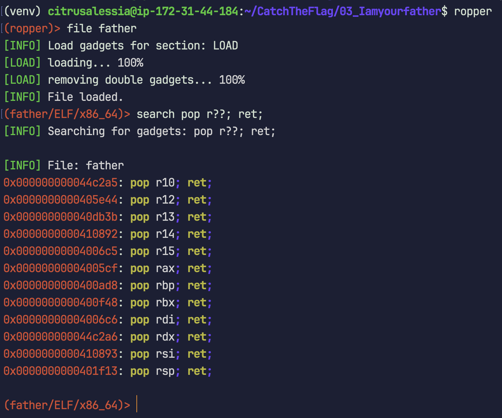

# Write-up CTF 11/2023, Catogory: Pwn


## objdump commands
### objdump -h `<`executable`>`
查看執行檔的 section headers
- `Size` - section 的大小
- `VMA` - section _**預定**_ 映射 (mapping) 在記憶體中的虛擬地址 (virtual memory address)


## gdb commands
[gef –– GDB Enhanced Features 安裝教學](https://hugsy.github.io/gef/install/)


### x/`<`length/format/unit`>` `<`addr`>`
`x`: 檢查記憶體中的內容。x 是 examine 的縮寫\
length, format, unit 是可選的參數
#### length —— 顯示的單位數量
#### format —— 顯示格式
- `x` - hexadecimal (十六進制)
- `d` - decimal (十進制)
- `u` - unsigned decimal (無符號十進制)
- `o` - octal (八進制)
- `t` - binary (二進制)
- `a` - addr (地址)
- `i` - instruction (機器指令)
- `c` - char (字符)
- `s` - string (字串)
#### unit —— 顯示單位
- `b` - byte (8-bits)
- `h` - halfword (16-bits)
- `w` - word (32-bits)
- `g` - giant word (64-bits)

### checksec
檢查執行檔的安全性，是否開啟了 NX, PIE, RELRO, Canary 等等的保護機制。

### info proc mappings & vmmap
查看執行檔中，sections _**最終實際**_ 映射 (mapping) 在記憶體中的虛擬地址 (virtual memory address)
- `r` - 可讀
- `w` - 可寫
- `x` - 可執行
- `p` - 私有


## ropper commands
[Ropper 安裝教學](https://shantoroy.com/security/using-ropper-to-find-address-of-gadgets/)

### source venv/bin/activate; ropper
啟動 Ropper 交互式介面

### file `<`executable`>`
讀入 ELF 執行檔

### search `<`instruction`>`
尋找 ROP gadgets

_Example:_\



## Challenges

### 03_Iamyourfather
#### Methods
* fork() –– Multi-Process
* Canary brute forcing
* ROP gadgets


### 04_wakuwaku
#### Methods
* PLT –– Procedure Linkage Table
* GOT –– Global Offset Table


### 05_shellcode
#### Methods
* Shellcode basic

#### Solving Process
題目有給 C code，先打開來看看：
```c
#include <stdlib.h>
#include <stdio.h>

void init() {
	setvbuf(stdin, NULL, _IONBF, 0);
	setvbuf(stdout, NULL, _IONBF, 0);
	setvbuf(stderr, NULL, _IONBF, 0);
	return;
}

int main() {
	init();
	char buf[200];

	puts("Input something in this buffer!!!");
	read(0, buf, 200);

	void (*func)() = (void (*)())buf;
	(*func)();

	return 0;
}
```
首先要了解 function pointer 的概念，可以參考 [C 語言中的函數指標](https://openhome.cc/Gossip/CGossip/FunctionPointer.html)。

為了更深刻得意會到這段程式碼在做什麼，使用 `objdump -d <executable>` 反組譯執行檔的 .text 區段，擷取出對應 C code 中的這兩行的組合語言：
```c
void (*func)() = (void (*)())buf;
(*func)();
```
```assembly
  401221:	48 8d 85 30 ff ff ff 	lea    rax,[rbp-0xd0]
  401228:	48 89 45 f8          	mov    QWORD PTR [rbp-0x8],rax
  40122c:	48 8b 55 f8          	mov    rdx,QWORD PTR [rbp-0x8]
  401230:	b8 00 00 00 00       	mov    eax,0x0
  401235:	ff d2                	call   rdx
```
來解析一下這段組合語言在做什麼：

第1, 2行在把 `buf` 的值 寫入 `func` 的位址`[rbp-0x8]`\
第3~5行要呼叫 `func`\
明顯就是要讓 rip 跳到 stack segment 執行 `buf` 的內容 (shellcode)

用 `checksec` 檢查執行檔的安全屬性，可以看到 NX 沒開：
```terminal
[+] checksec for '/home/citrusalessia/CaptureTheFlag/05_shellcode/shellcode'
Canary                        : ✘ 
NX                            : ✘ 
PIE                           : ✘ 
Fortify                       : ✘ 
RelRO                         : Partial
```

所以接下來只要將 sys_execve 的 shellcode 寫入 `buf`，就可以成功了，
shellcode 可以參考 [shell-storm](http://shell-storm.org/shellcode/)，這裡使用的是 [Linux/x86 - execve(/bin/sh) Shellcode (21 bytes)](http://shell-storm.org/shellcode/files/shellcode-827.php)


### 06_shellcode2
#### Methods
* Shellcode basic
* Shellcode crafting
* jmp instruction
* `read` syscall

#### Solving Process
題目有給 C code，先打開來看看：

```c
#include <stdlib.h>
#include <stdio.h>

void init() {
	setvbuf(stdin, NULL, _IONBF, 0);
	setvbuf(stdout, NULL, _IONBF, 0);
	setvbuf(stderr, NULL, _IONBF, 0);
	return;
}

int main() {
	init();
	char buf[200];

	puts("Input something in this buffer!!!");
	puts("However,you can't input 'nop' such as '0x90' this time!!!");
	puts("And also,you need to bypass some restrictions in your shellcode!!!");
	read(0, buf, 200);

	for (int i = 0; i < 200; i++) {
		if (buf[i] == '\x90') {
			puts("You can't input '0x90' this time!  :(( ");
			exit(0);
		}
	}

	for (int i = 0; i < 10; i++) {
		if (buf[i*20] != '\x0c' && buf[(i*20)+1] != '\x87' && buf[(i*20)+2] != '\x63') {
			puts("Try to bypass the restriction!!!");
			puts("Try again!!!");
			exit(0);
		}
	}

	void (*func)() = (void (*)())buf;
	(*func)();

	return 0;
}
```
可以看到這次的限制有兩個：
1. 不能輸入 `nop` (0x90)
2. 每 20 bytes 會檢查前三個 bytes 是否為 `0x0c 0x87 0x63`（好中二XD）

因此，能否用第一組 `0x0c 0x87 0x63` 為開頭湊出有效的指令集，並且使用 `jmp` 指令跳過剩下的 `0x0c 0x87 0x63`，就是解出這題的關鍵


### 07_shellcode3
#### Methods
* Shellcode basic
* Shellcode crafting
* NOPs
* `read` syscall


